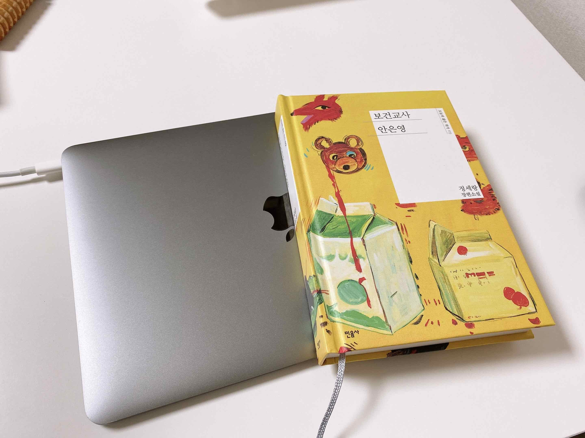
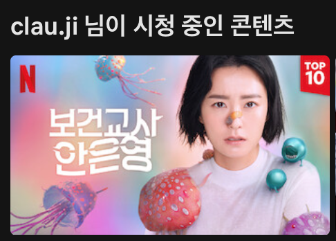

# 추석 연휴에는 보건교사 안은영

### 화요일부터 일요일까지

긴 긴 연휴다. 월요일도 연차를 썼으면 토요일부터 일요일까지 9일이나 되는 긴 연휴였을 것이다. 아쉽게도 연차가 몇 개 남지 않아 아껴야 했으므로 월요일엔 출근했다. 그래서 나는 화요일부터 일요일까지 6일간의 연휴였다. 그래도 꽤 길었다. 화요일엔 늦잠을 자고 미뤄놨던 설거지와 쓰레기 정리를 하고 나니, 오전이 다 갔다.

### 책 속의 안은영

점심때는 '보건교사 안은영' 책을 사러 집 앞 영풍문고에 갔다. 전날 밤 아내와 함께 넷플릭스로 보건교사 안은영 드라마를 시작했는데, 계속 "읭? 읭?" 하면서 봤다. 근데 장면들이 웃기고 재밌는 게 많아서 보다 보니 세 편이나 봤다. 드라마는 여섯 편으로 짧게 제작이 돼서 그런지 장면 사이의 흐름이 끊기는 느낌이 있어서, 책을 보면 뭔가 이해가 될 것 같았다.

서점에서 안은영 책을 본 건 오래되었다. '82년생 김지영'을 비롯한 민음사의 오늘의 젊은 작가 시리즈의 표지 디자인이 예뻐서, 눈여겨보고 있었다. 각 책마다의 주제나 느낌을 표지에 표현하고 있는 것 같았다. 그중에서 보건교사 안은영은 알록달록한 노란 책이었다. 넷플릭스에서 개봉(?) 하면서 특별판으로 표지 디자인이 개정된 것 같지만, 키 컬러가 파란색으로 바뀌었을 뿐 알록달록한 건 똑같다. 젊은 작가 시리즈는 표지 안쪽에 그림에 대한 설명이 있다. 노란 책의 표지 그림에 대한 설명은 이렇다.

> 'Untitled(정수진)' 형상이 가진 이중적 의미에 대해 탐구한 작품 중 하나로서 겉으로는 만화적으로 표현된 형상이지만 형상에 내재된 색형구조는 순수 추상에 대한 논리 구조를 가지는 그림이다. 이것은 이 세상이 수많은 개별적 서사로 가득한 것처럼 보이지만 내적으로는 질서와 균형을 위한 구조를 바탕으로 운용되고 있음을 의미한다.

내가 쉽게 이해하기로는, 눈으로 보이는 '현상'들이 보이지 않는 매개에 의해 서로 연관되어 있다는 말 같다. 책 속에서 안은영은 그 매개를 보는 존재이다. 퇴마사이자 심령술사라고 소개되는 안은영은 인간이 만들어 내는 감정, 사념이나 죽은 인간 그 자체를 본다. 많은 사람들이 보지 못하는 것을 보면서 남들에게 이해받지 못하고 따돌림당하는 어린 시절을 보낸다.

### 비비탄 총과 장난감 칼로 귀신과 맞서는 안은영

책 표지의 그림처럼 장면들은 매우 만화적이다. 어린 시절 누구나 한 번쯤 해봤을 만한, 장난감 총과 칼로 악의 무리를 때려잡는 것. 휘황찬란한 불빛을 내뿜는 접이식 칼과 퓽퓽 소리를 내며 발사하는 권총이다. 그걸 다 큰 어른이, 그것도 선생님이라는 작자가 학교에서 애들이 보는 앞에서 총칼을 휘젓고 다닌다. (넷플릭스로 먼저 보고 책을 읽고 있어서, 드라마의 이미지가 너무 강하게 박힌 것 같기도 하다. 처음 볼 때는 되게 당황스럽고 웃긴데, 보다 보면 보는 나도 굉장히 진지해지고 이입하게 된다.) 안은영이 때려잡는 귀신은 형형색색의 젤리들이다. 아마도 귀신을 젤리로 표현한 듯하다.

귀신을 보는 이야기는 많지만, 보건 교사 안은영이 특별한 점은 그 이야기를 어떤 거대한 음모나 속죄로 풀어내지 않고 일상적인 유쾌함으로 풀어낸다는 거다. 특이한 직업이 아닌 우리에게 친근한 교사, 그중에서도 직업으로서는 그다지 인기가 없는 보건교사를 하면서 학교 안에서 생기는 여러 문제를 소박하게 해결한다. 안은영은 자기 능력의 한계를 잘 알고 있는 듯하고, 자신의 능력 또는 주변 사람들과 함께 문제를 해결한다. 젤리를 볼 수 있는 사람은 혼자지만 주변 사람들은 안은영을 믿고 문제를 해결할 수 있도록 잘 돕는다.

만화적인 겉모습 이면에는 가볍지 않은 내용도 있다. 어릴 적부터 귀신을 봐온 은영이 자라면서 느낀 것들이 한편에 나온다. 아직 책을 다 읽진 않았지만 그중에서 와닿았던 건 '격하게 몸부림치며 부서지는 죽음도 있는가 하면 정현처럼 비누장미같이 오래 거기 있는 죽음도 있는 것이다.' 이 독백을 영상으로 보면 꼬깔콘 PPL 인가 싶긴 하지만, 뭔가 아득함을 주는 그런 느낌이다. 안은영과 가까웠던 사람들은 주로 비누장미 같은 죽음을 맞이한다. 한이 아닌 인생에 대한 아쉬움을 갖고 있는 사람들이 긴 시간을 귀신으로 살아가며 아쉬움을 달래는 듯한 느낌이다.

### 도구를 써라, 그리고 다치지 말고 경쾌해라

안은영이 지금의 안은영이 되기에는 오랜 친구의 역할이 컸다. 목글 초기에 나도 고민했던 브랜딩. 안은영의 컨셉을 잡아준 것이다. 사람들이 좋아하려면 칙칙하고 우울할 게 아니라, 유쾌하고 재밌어야 한다. 맨몸으로 할 수 없다면 도구를 써라. 책에서는 '캐릭터를 바꾼다', '장르를 바꾼다'라고 나온다. 인생의 장르를 결정하는 건 우리에게 달려있다. 최고가 될 수는 없지만, 그랬다고 비관할 필요도 없다는 뜻인 것 같다. 자기가 할 수 있는 만큼 하면 되고, 못 하겠으면 딴 걸 하면 되고 (안은영도 이직한다), 혼자 못하면 함께 하면 되고. 우울해하지 말고 자기가 가진 것 안에서 잘 살자. 다치지만 말고 잘 살자. 가끔 볼 때면 왜 이렇게 사나 싶을 때도 있지만, 하루하루 사는 게 의미가 있는 것 같다.

안은영이 요즘의 나에게 한 마디 하는 것 같다. 이 길이 맞는 건지, 그리고 앞으로는 어떻게 살아야 하는 건지 생각하다 보면 답답하기만 하다. 이렇게 하면 될 것 같은데, 저렇게 하면 될 것 같은데. 생각은 끝이 없다. 이미 늦은 것 같기도 하고, 지금이 빠른 것 같기도 하고. 그러는 중간에 가끔 이런 생각이 들 때가 있다. 내가 고민하고 있는 것들의 '기준'이 무엇인가. 하나하나 따져보면 내가 고민하는 것들은 다 주변 사람들이 기준인 것 같았다. 어떤 학교를 가고, 어떤 전공을 하고, 무엇을 배우고, 어떤 직장을 갖고. 심지어 내가 하고 싶은 것조차 주변 사람들의 눈치를 보는 것 같았다. 나만의 가치라고 말하는 것조차 주변에 맞추는 것 같았다. 그래서, 그 사람들처럼 살지 못하고 있기 때문에 내가 우울한가 하는 생각.

진짜 내가 하고 싶은 대로 살아야 마음이 편해진다. 다른 사람에 기준을 두기보다는, 내가 살고 싶은 방식으로, 내가 하고 싶은 대로. 다치지만 않으면 유쾌하게 사는 편이 나으니까.