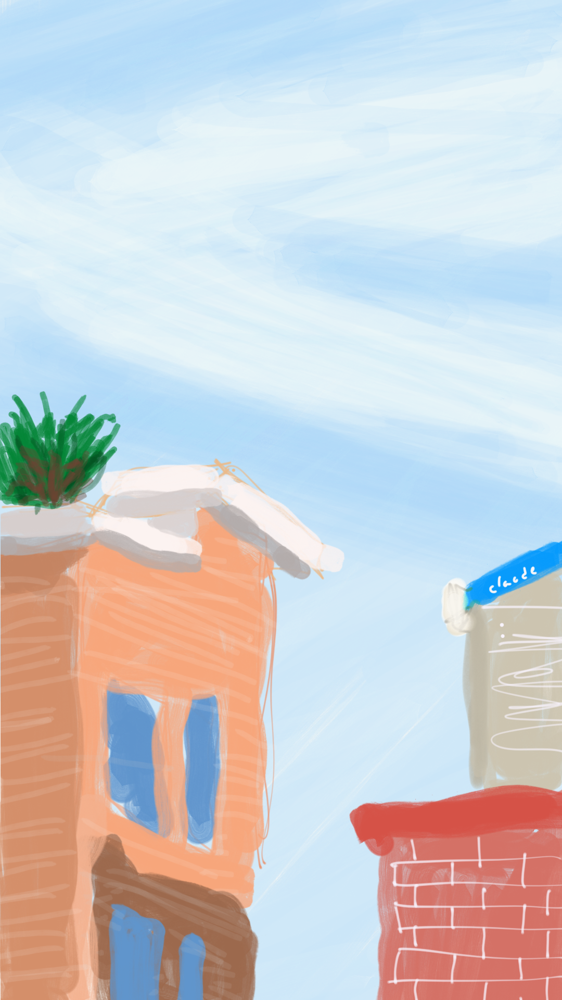

# 폰으로 그림 그리기

### 그림 그리는 방법

1. 스마트폰을 잠금 해제 한다.
2. 구글 Play 스토어 또는 앱스토어 앱을 켠다.
3. Adobe Photoshop Sketch 앱을 다운로드한다.
4. 앱에 로그인을 한다.
5. \+ 버튼을 눌러, 새로운 그림판을 생성한다.
6. 붓을 선택해 두께, 투명도와 색상을 설정하고 쓱싹 그린다.
7. 서명을 하고 그림을 완성한다.

### 그림 그리기 팁

1. **그림을 잘 그리고 못 그리고는 중요하지 않다**
   중요한 건 끝까지 그리느냐 포기하느냐의 차이. 일단 내가 그리고자 한 걸 다 그리고 나면, 그림을 그리는 방식은 컨셉이라고 말할 수 있다. 다음에 그릴 때도 똑같은 방식으로 계속 그리면 된다.
2. **그림의 포인트를 정하자**
   화가가 아닌 이상, 모든 걸 다 잘 그릴 순 없다. 내가 제일 그리고자 했던 대상에 시간과 노력의 80%을 쏟는다. 그걸 돋보이게 하기 위한 부차적인 대상들은 쓱싹 빠르게 그려내자. 이번 그림 같은 경우에는 하늘이 포인트다.
3. **디테일이 걱정될 땐 일단 크게 그리자**
   해상도가 마법을 부린다. 당연하게도 크게 그려놓고 작게 축소하면 삐져나오거나 잘못 칠하거나 등등 작은 디테일들은 사라진다. 그럴듯한 그림이 된다. 미세하게 그려야 할 때도, 크게 해놓고 크게 크게 그리면 도움이 된다.
4. **레이어 꼭 나누기**
   한 레이어에 겹쳐서 그리기보다는 형태마다, 색깔마다, 붓 종류마다 레이어를 나누면 좋다. 많이 나눌수록 편집하기는 좋지만 관리하기가 번거로워지므로, 몇 번 그려보면서 연습한 후 자신한테 잘 맞는 구분 방법을 찾는 게 좋다.
5. **저렴한 터치펜이라도 쓰기**
   아무래도 손보다는 펜이 낫다. 몇천 원짜리 저렴한 펜이라도 손가락보다 나은 것 같다. 언제고 계속 확대해서 크게 그릴 순 없으니, 조금이나마 정교하게 그리려면 필요하다. 

### 손 그림은 너무 어렵다

초등학교 2학년 때는 불조심 포스터 대회에서 장려상(?)을 받은 나이지만, 그 이후로 그림 실력은 발전하지 않았다. 이집트 벽화 같은 그리기 방식의 소유자로, 그래도 이집트랑 다르게 얼굴은 정면 몸은 측면으로 그린다. ([이집트 벽화 그림이 어색한 이유 - 모놀 이종원](https://brunch.co.kr/@ljhkhs44/6)) 이집트 사람들은 육신의 영원성을 표현하기 위해 부위별로 분리해서 그렸다지만, 나는 그냥 그림 실력 부족이었다. 그 후로 미술 시간마다, 나의 실력을 알기에 그림 그리기를 주저하고 꼭 그려야 한다면 추상화 위주로 그림을 그렸다. 나름 함축적인 의미를 담았다고 주장하고 싶었다. 사실은 최대한 눈에 보이는 걸 그대로 그리는 건 피하고 싶었다.

형태도 형태지만, 물감을 섞어 색을 만드는데도 재능이 없었다. 머릿속에 존재하는 색깔이 현실에 나오려면 너무도 많은 시행착오를 거쳐야 한다. 대부분의 경우는 너무 많은 색이 섞여버려서 검은색으로 끝나고 만다. 또, 재료마다 다른 색 표현 방법은 나를 혼란스럽게 만들었다. 색연필은 색이 거의 섞이지 않고 서로 빈 곳을 채워 생기는 오묘한 색이 되어버리고, 펜은 농도 조절이 안 되어서 두 가지 색만 섞여도 금세 검은색으로 변하고 만다. 잉크가 뭉쳐서 손에 묻어나는 건 보너스다.

한 번 그리고 나면 수정이 어렵다는 점도 문제다. 펜이나 색연필, 물감, 유화 등 미술 도구를 이용해서 그림을 그리기에 주저하게 된다. 그림 잘 그리는 사람들은 (종류에 따라 다르지만 대부분) 다시 그 위에 원하는 색으로 덧칠하면 된다고 하지만, 신기하게도 나는 그런 재능이 없다. 덧칠하면 색깔이 이상해진다. 내가 의도한 색은커녕 원래 있던 그림이 더 망쳐진다. 물감으로 그림 그릴 때 덧칠하다 보면, 물이 너무 많아서 종이가 젖어 꾸겨지거나 심지어 찢어지는 경우도 생긴다. 그림 도구는 다루기 너무 섬세하다.

### 폰 그림은 좀 쉽다

그냥 많이 쉬운 건 아니고, '좀' 쉽다. 형태 그리기와 머릿속의 색깔만 해결하면, 나머지는 좀 낫다. 색깔 고르는 건 Color Picker가 있다. 표현할 수 있는 모든 색상을 쫙 보여주고 그중에서 적절한 색깔을 고르면 된다. 마우스로 드래그해가면서 내가 원하는 색과 비교하면서 끊임없이 변경할 수 있다. 너무 편한 것. 머릿속의 색깔을 정하는 게 어렵다면, 다른 사람들이 만들어놓은 Color Palette를 참고하면 된다. 요새는 심지어 원하는 분위기의 이미지를 업로드하면, 주요 컬러를 뽑아 어울리는 색들로 Palette를 만들어주는 서비스도 있다. 너무 좋은 세상이다.

수정도 쉽다. 위에 그리기 팁에서 나열한 것들이 대부분 해당된다. 그림의 일부분을 확대, 축소해가며 그림 그릴 수도 있고, 내가 원하는 적절한 두께와 심지어 투명도도 조절할 수 있다. 너무 잘못 그리면 실행 취소하고 다시 그릴 수도 있다. 현실이라면 기름종이에 그리고 겹쳐서 봐야 할 텐데, 레이어도 지원해 준다. 그림을 z 축으로 나눠서, 부분별로 그리고 부분별로 수정할 수 있다. 이 정도 편리함이면 나 같이 그림 못 그리는 사람도 어느 정도 그릴 수 있다. 물론 아직도 형태와 색깔은 해결이 안 된다. 이건 너무 창작의 영역이다. 그러니, 우기는 수밖에... (?) 내 컨셉은 대충 그린 그림~