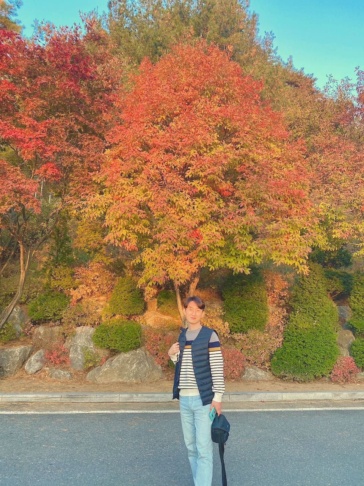
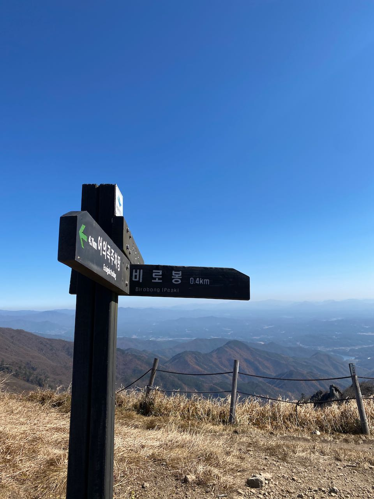
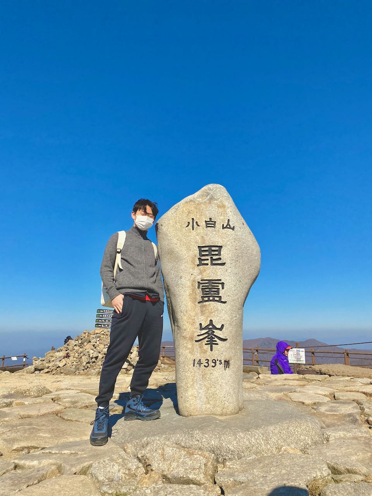
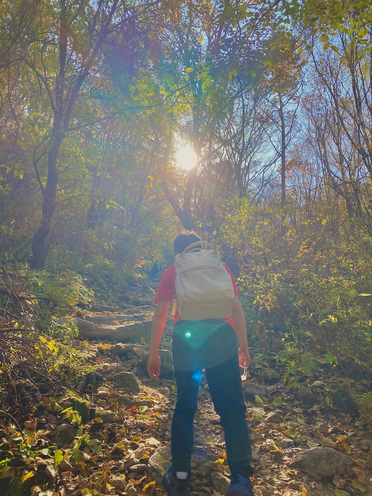
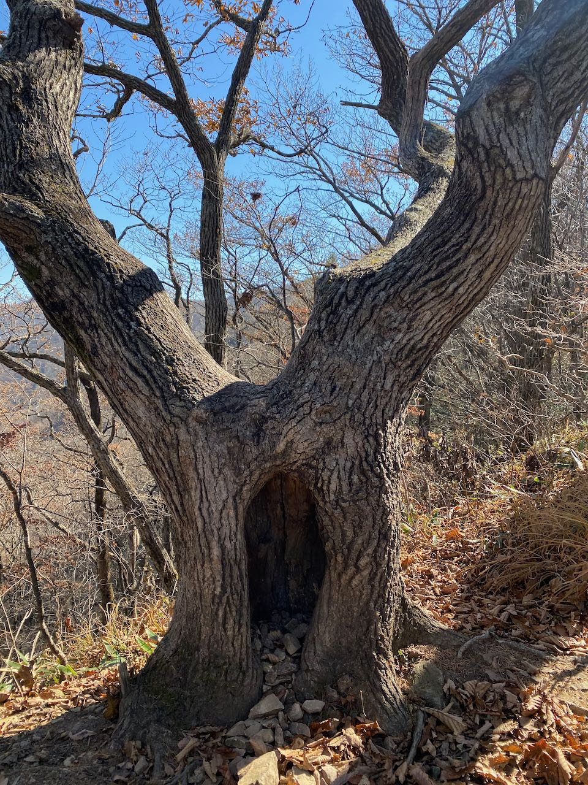
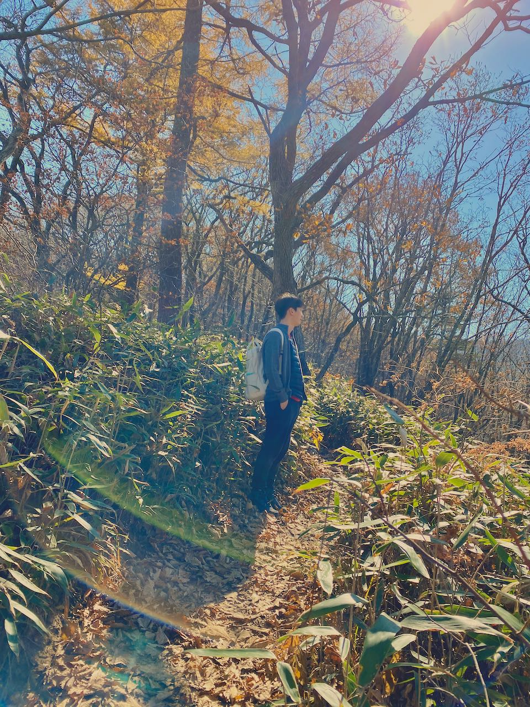
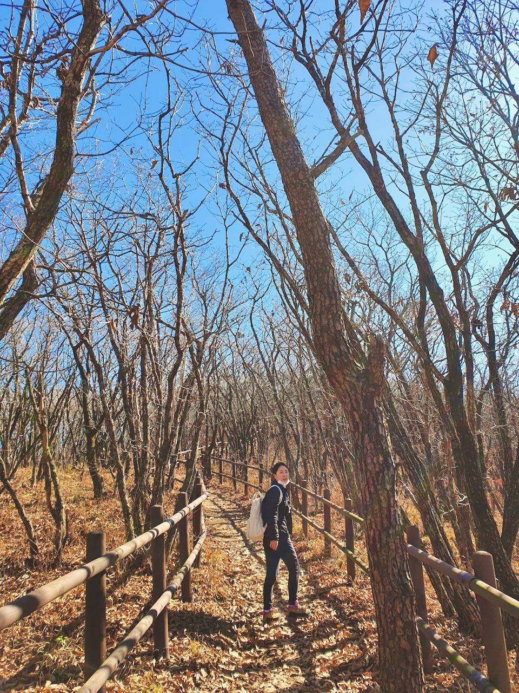
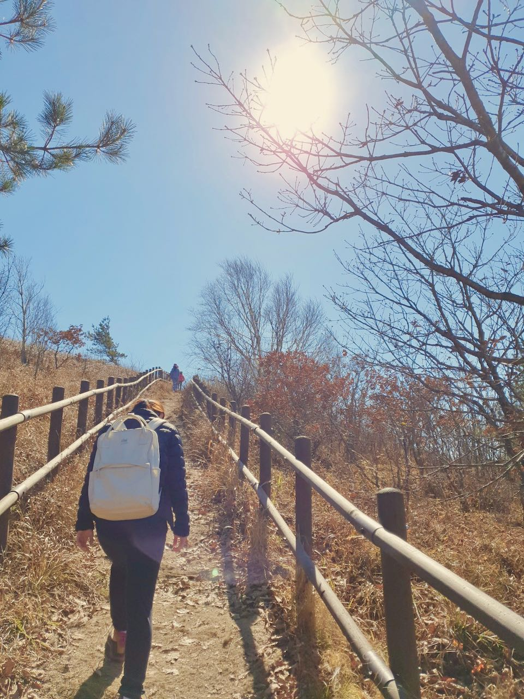
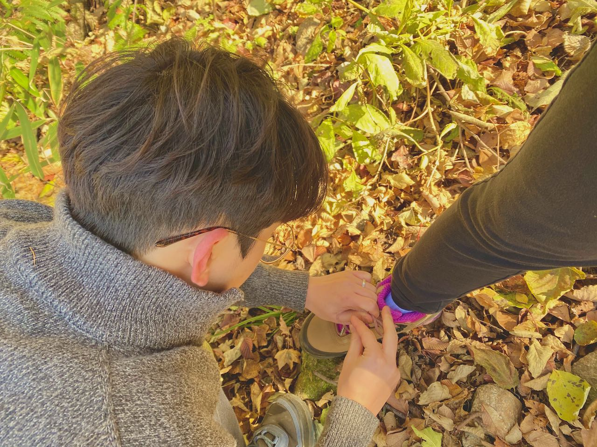

# 소백산 비로봉을 오르다

### 완연한 가을, 단양

지난 주말은 꽤 추웠다. 안 그래도 요즘 날이 많이 추웠는데, 주말에는 최고, 최저 기온이 무려 5도 정도씩 떨어졌다. 단양은 서울 보다 조금 아래 지방이라 추워져봤자 서울이랑 비슷할 줄 알았는데, 전국적으로 추웠는지 비슷했다. 덕분에 날씨는 맑아져서 여행하기 좋았다. 우리가 묵었던 소노문 단양에는 단풍이 멋들어지게 졌다. 눈으로 봤을 때는 햇빛과 어우러져 훨씬 예쁜 색깔인데, 사진으로는 그게 잘 담기지 않는다. 그래도 그 순간을 기억하기 위해 사진을 찍어봤다.

단양은 작은 동네라 차로 금방 다닐 수 있는데, 가는 곳마다 다 예뻤다. 특히 패러글라이딩을 하기 위해 동산을 올라가는 길은 양쪽으로 가로수가 노랗게 졌다. 바람이 불 때마다 낙엽이 떨어지는 모습이 너무 예뻤다. 운전 중이라 사진으로 담을 수 없는 게 너무 아쉬웠다.

### 동네 뒷산같이 친근하지만, 이래 봬도 산맥이다

둘째 날은 소백산에 올랐다. 가장 높은 봉우리는 비로봉인데, 백두대간 소백산맥을 이루는 봉우리 중 하나다. 산맥답게 무려 1439.5m로 꽤 높다. 지난주에 다녀왔던 관악산은 가장 높은 봉우리인 연주대가 632.2m인데, 두 배가 넘는다. (연주대를 다녀온 건 아니다. 늦게 올라갔는데, 거리가 너무 멀어서 중간까지만 다녀왔다)

한라산을 두 번이나 다녀온 나는, 소백산쯤이야- 싶었다. 하지만, 비로봉에 다녀오니 한라산보다 훨씬 힘든 코스라고 느껴졌다. 생각해보니 그게 당연한 거였다. 두 번씩 다녀온 한라산 영실 코스와 어리목 코스는 각각 해발 1280m와 970m에서 출발해서 윗세오름 대피소가 있는 1700m까지다. 그때는 백록담까지 다녀오지 않았으니, 실제로 다녀온 고도차는 500m, 800m 남짓이다. 어리목 코스가 조금 힘들게 느껴지긴 했지만, 사람들이 많이 다니기에 정비도 잘 되어 있고, 계단으로 되어있는 곳이 많아서 그런지 그냥저냥 괜찮았다.

반면 소백산의 어의곡 코스는 사람들도 많이 오지 않는 코스기도 하고 여름에 폭우로 탐방로에 돌멩이들이 많아 쉽지만은 않았다. 등산 시간도 2시간 반이나 걸렸다. 듣는 말에 의하면 어의곡 코스는 천동 코스에 비해 경치랄 게 별로 없었다. 초반에는 동네 뒷산같이 작은 길을 따라 올라가다가, 뿌리와 바위, 돌멩이로 만들어진 등산로가 나온다. 다듬어지지 않은 듯한 느낌을 주는 길이고 완만해서, 크게 인상적이진 않았다.

그러나 중반부터는 달라진다. 한 시간 반쯤 올라가면, 나무가 갑자기 낮아지면서 하늘이 가깝게 보인다. 이때부터는 약간 호주의 자연보호 트레킹 코스 같은 길이 나온다. 올라갈수록 추위와 바람 때문인지 벌써 낙엽이 다 떨어져 있다. 폭신한 길을 걷다 보면 내 머리 위엔 더 이상 나무가 없는 순간이 온다. 그때가 바로 정상이 가까운 시점이다. 이때부터는 무자비한 바람이 분다. 원래 그런지 아니면, 바람이 많이 부는 계절이라 그런 건지는 모르겠지만 거의 태풍 수준의 느낌이다. 비로봉까지의 마지막 400m는 능선을 따라 길이 나 있는데, 꽤 뾰족하게 나 있는 길이라, 너무 강한 바람 때문에 낭떠러지로 떨어질까 봐 너무 무서웠다.

<iframe width="544" height="306" src="https://serviceapi.nmv.naver.com/flash/convertIframeTag.nhn?vid=CDF44BADD8A055525C12B22D0DEBA2417904&outKey=V1235d007fad7f2bca70067c115d10b2840e290c79084840cabc567c115d10b2840e2" frameborder="no" scrolling="no" title="NaverVideo" allow="autoplay; gyroscope; accelerometer; encrypted-media" allowfullscreen></iframe>

### 새 신을 신고 상처가 남은 발

맨날 동네 뒷산만 오르다가 높은 산을 오른다고, 마음먹고 등산화를 사기로 했다. 단양 가는 길에 이천 아울렛에 들러서 스포츠 브랜드를 돌아다녔다. K2, 아이더, 밀레, 네파, 컬럼비아, 코오롱, 블랙야크를 봤다. 등산화는 기능이 제일 우선이라지만, 디자인을 추구하는 나로서는 등산화도 예뻐야 된다. K2나 컬럼비아, 블랙야크에 괜찮은 디자인들이 있었지만 한 번에 눈길을 끈 건 코오롱스포츠의 등산화였다. 정확히는 트레킹화인데, 그게 그거인 것 같다. 깔끔하고 매끄러운 디자인에 무게 있는 부드러운 색깔. 남성화는 블루와 카키색인데 둘 다 예쁘다. 여성화랑 세트로 있어서 커플 등산화로 구매했다. 앞으로 등산할 때마다 챙겨 신기로 했다.

요즘 보아 스타일이라고 해서, 끈을 묶는 게 아닌 조이는 형식이 간편하고 좋다. 하지만, 이 신발은 그런 형태는 아니라 조금 불편하지만, 아날로그 느낌의 감성이 있어서 더 예뻐 보인 듯하다. 다만 문제는, 끈을 내가 직접 조여야 하다 보니, 등산화가 처음인 나는 어느 정도가 적당한지 감을 잡기 어렵고, 좌우 밸런스를 맞추기도 조금 까다로웠다. 이번 소백산 등산을 할 때 왼쪽을 헐렁하게 묶었는지, 올라가면서 뒤꿈치가 쓸려서 물집이 잡혔다. 등산화는 100km는 걸어야 길이 든다고 하니, 다음 등산 때는 양말을 더 두껍게 신고 걸어야겠다.

